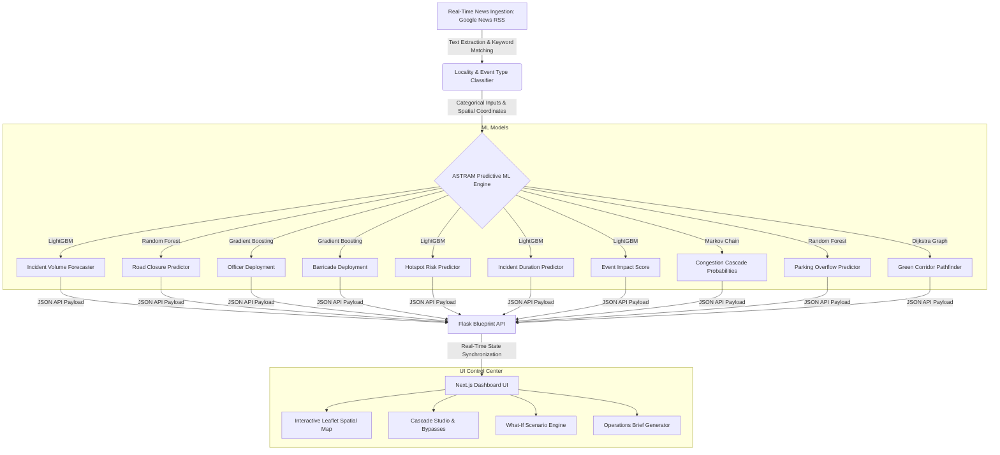

# ASTRAM CongestionIQ 🚦
> **Real-Time Event-Driven Traffic Intelligence & Operational Mitigation Platform**
> *Developed for the Flipkart Gridlock Hackathon 2.0 (Round 2)*

ASTRAM CongestionIQ is an advanced traffic management and planning platform designed to forecast, quantify, and mitigate traffic bottlenecks caused by localized events (such as festivals, protests, sudden VIP movements, and construction). 

By combining real-time news ingestion with a cascade of 10 specialized Machine Learning models and heuristics, ASTRAM predicts event-related traffic impact and outputs actionable recommendations for manpower (traffic officer deployment), barricading, and diversion routing.

---

## 🏗️ System Architecture



---

## 🌟 Key Features

1. **Real-Time Ingestion & Extraction:** Periodically scrapes Google News RSS feeds to identify ongoing and upcoming localized events in Bangalore, categorizing priority and matching them to exact geo-coordinates.
2. **Quantified Event Impact:** Leverages ML models to predict event duration, hotspot risk, and a composite Event Impact Score in advance of gridlocks.
3. **Dynamic Resource Deployment:** Recommends exact officer counts and barricade placements based on predicted closure probability and priority level.
4. **Congestion Cascade Studio:** Uses Markov Chains to simulate the propagation of traffic congestion to adjacent corridors over 30 and 60 minutes.
5. **Emergency Green Corridor Pathfinder:** Finds optimal signal override paths and bypasses using Dijkstra's algorithm mapped over historical road criticalities.
6. **What-If Scenario Engine:** Allows operators to apply simulated perturbations (e.g. heavy rain, metro breakdown, +20k visitors, VIP movements) and instantly view adjusted resource requirements.

---

## 🛠️ Project Structure

```
├── app/                      # Next.js App Router (pages & routing)
├── backend/                  # Flask Backend Services
│   ├── models/               # ML Predictors, model loaders & inference functions
│   ├── routes/               # API blueprints (dashboard, news, predictions)
│   ├── scrapers/             # RSS parser & Google News scraping services
│   ├── config.py             # Location mappings & system-wide constants
│   └── requirements.txt      # Python dependencies
├── components/               # React UI Components (maps, charts, KPI widgets)
├── trained_models/           # Serialized joblib models (.pkl) & encoders
├── ASTRAM_CongestionIQ_ML.ipynb # Jupyter notebook for model training
└── package.json              # Frontend package manager config
```

---

## 🚀 Setup & Execution Instructions

Follow these steps to run both the frontend and backend servers locally.

### 1. Prerequisite Environments
- **Node.js:** v18.x or above
- **Python:** v3.9.x - v3.11.x

---

### 2. Backend Setup (Flask API)
Navigate to the `backend/` directory, set up a virtual environment, and start the development server.

```bash
# Navigate to the backend
cd backend

# Create a virtual environment
python -m venv .venv

# Activate virtual environment
# On Windows (PowerShell):
.venv\Scripts\Activate.ps1
# On Linux / macOS:
source .venv/bin/activate

# Install required packages
pip install -r requirements.txt

# Start the Flask backend server (Runs on port 5000)
python -m flask --app __init__ run --port=5000
```

*Note: Ensure your virtual environment is active during execution.*

---

### 3. Frontend Setup (Next.js Application)
Navigate to the project root directory, install dependencies, and run the Next.js development server.

```bash
# Return to the project root
cd ..

# Install NPM dependencies
npm install

# Start the Next.js dev server (Runs on port 3000)
npm run dev
```

Open [http://localhost:3000](http://localhost:3000) in your browser to view the interactive dashboard.

---

## 📊 Machine Learning Model Details

| Model Name | Type | Target | Performance |
| :--- | :--- | :--- | :--- |
| **Incident Volume** | LightGBM | Number of concurrent incidents | R²: 0.84 |
| **Road Closure** | Random Forest | Binary probability of closure | Accuracy: 91.2% |
| **Officer Deployment** | Gradient Boosting | Count of traffic officers needed | MAE: 1.2 |
| **Barricade Deployment** | Gradient Boosting | Barricade units to deploy | MAE: 1.8 |
| **Hotspot Risk** | LightGBM | Junction risk score (0-100) | R²: 0.89 |
| **Event Impact** | LightGBM | Composite impact index | R²: 0.99 (High Fit) |
| **Congestion Cascade** | Markov Chain | Risk spread probability | Mean Prob: 27%-41% |
| **Parking Overflow** | Random Forest | Parking risk indicator | Accuracy: 97.7% |
| **Green Corridor** | Dijkstra Graph | Shortest path route search | 22 nodes, 462 edges |

---

## 📝 License
This project is open-source under the MIT License. Developed for educational and hackathon evaluation purposes.
