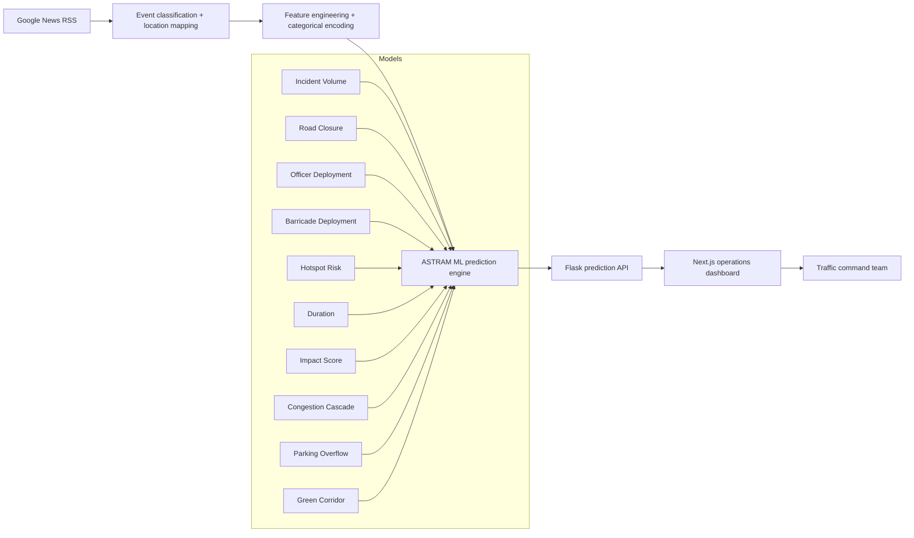

# ASTRAM CongestionIQ — Hackathon Pitch Document

## Executive Summary

ASTRAM CongestionIQ is a real-time traffic intelligence and operational mitigation platform built for the Flipkart Gridlock Hackathon. It transforms noisy event signals into precise recommendations for city traffic operations, combining live news ingestion, topology-aware routing, and a cascade of 10 specialized machine learning models.

The platform is designed to help traffic teams shift from reactive incident handling to proactive control by forecasting event impact, estimating resource needs, modeling congestion spread, and recommending green-corridor routing.

## Problem Statement

Urban traffic management systems are often overloaded during localized incidents such as:
- protests and rallies
- religious processions and festivals
- construction closures
- VIP convoy movements
- severe weather or transit disruptions

These events cause rapid, localized gridlocks that current operations teams struggle to anticipate. Existing dashboards may show congestion after it occurs but do not answer "How many officers should be mobilized?" or "Where should barricades and alternative routes be activated?"

## Proposed Solution

ASTRAM CongestionIQ closes that gap with a unified command center that:
- ingests news and event alerts in real-time
- classifies event type, location, and priority
- predicts incident volume, closure probability, hotspot risk, duration, parking overflow, and impact score
- simulates congestion cascade spread
- computes emergency green corridor routes on the corridor graph
- enables what-if scenario analysis for contingency planning

## Key Differentiators

- **Event-first intelligence:** Converts unstructured news into structured traffic impact signals.
- **Multi-model decision engine:** Uses predictive ML for both resource recommendation and risk assessment.
- **Operational output:** Produces actionable recommendations, not just analytics.
- **Scenario simulation:** Allows teams to compare baseline vs perturbation scenarios instantly.
- **Emergency routing:** Computes alternate routes with Dijkstra over corridor graphs and evaluates signal override sequences.

## Product Architecture

### Core Layers
1. **Data ingestion**
   - News scraping from Google News RSS.
   - Location mapping to Bangalore corridors and zones.
2. **Feature engineering & encoding**
   - Categorical encoders support event type, zone, corridor, priority, and time.
3. **ML prediction pipeline**
   - Ten specialized models for traffic, risk, and routing.
4. **API & orchestration**
   - Flask backend serves prediction endpoints and dashboard payloads.
5. **Frontend control center**
   - Next.js dashboard with map, event analysis, scenario simulator, and operations brief.

### Architecture Diagram

## Feature Breakdown

### 1. Real-Time Event Intelligence
- Ingests news alerts and event summaries.
- Maps text to known localities and corridors using backend geolocation mappings.
- Assigns event priority and risk category.

### 2. Predictive Incident Analysis
- Predicts incident volume using a LightGBM regressor.
- Computes closure probability with a Random Forest classifier.
- Estimates officer and barricade demand with gradient boosting models.
- Quantifies hotspot risk and corridor stress.

### 3. Composite Operational Impact
- Builds a composite Event Impact Score based on predicted volume, closure, duration, and corridor criticality.
- Generates an operations brief with recommended actions.

### 4. Congestion Cascade Studio
- Simulates risk propagation using Markov-based corridor adjacency.
- Estimates 30-minute and 60-minute probability spread.
- Highlights adjacent corridors likely to see spillover.

### 5. Emergency Green Corridor Routing
- Finds a shortest path through the corridor network using Dijkstra.
- Computes signal override sequence and alternative detour.
- Supports route planning during emergency movements.

### 6. Scenario Analysis
- Applies perturbation multipliers for weather, crowd growth, and unplanned incidents.
- Compares baseline vs disrupted states for staffing and resource planning.

## Technical Stack

### Backend
- Python 3.9+ with Flask.
- Model management via `backend/models/model_loader.py`.
- Prediction services in `backend/models/predictors.py`.
- API endpoints exposed through `backend/routes/`.
- Local data/config mappings in `backend/config.py`.

### Frontend
- Next.js App Router.
- React components in `components/`.
- Prediction hooks in `hooks/use-ml-predictions.ts`.
- API client wrappers in `lib/ml-api-client.ts`.
- Interactive map and dashboard UI with Leaflet.

### Data & Models
- Serialized model artifacts and encoders in `trained_models/`.
- Notebook analysis in `ASTRAM_CongestionIQ_ML.ipynb`.
- Feature engineering and label encoding controlled from the backend.

## ML Model Inventory

| Model | Purpose | Type | Input Highlights |
|---|---|---|---|
| Incident Volume | Expected concurrent incident count | LightGBM | zone, corridor, event type, hour, weekday |
| Road Closure | Closure probability | Random Forest | event type, priority, duration, corridor |
| Officer Deployment | Traffic officer recommendation | Gradient Boosting | priority, corridor, event type |
| Barricade Deployment | Barricade recommendation | Gradient Boosting | closure risk, event type |
| Hotspot Risk | Junction-level risk score | LightGBM | junction, hour, event type |
| Duration | Event duration in minutes | LightGBM | event cause, vehicle type, corridor |
| Impact Score | Composite event impact | LightGBM | closure, volume, criticality |
| Cascade | Corridor spillover risk | Markov model | corridor, hour, event cause |
| Parking Overflow | Parking congestion risk | Random Forest | event density, closure, corridor |
| Green Corridor | Emergency route search | Dijkstra graph | origin, destination |

## User Journey

### Operator Flow
1. Open the dashboard.
2. Review active event alerts and map hotspots.
3. Select an event or create a new event scenario.
4. View predicted metrics: volume, closure, risk, duration, impact.
5. Review recommended officer and barricade deployment.
6. Run scenario perturbations for worst-case planning.
7. Compute green corridor route for emergency response.
8. Generate a concise operations brief.

### Demo Flow
1. Start with the live dashboard and news event feed.
2. Highlight the event classification and mapped corridor markers.
3. Run a sample event analysis and explain each prediction.
4. Show the cascade spread visualization for adjacent corridors.
5. Simulate a scenario such as VIP movement or festival crowd increase.
6. Compute an emergency green corridor and present route guidance.
7. End with the operations brief as a summary decision support package.

## Impact and Value Proposition

- Reduces incident reaction time by surfacing predicted event impact.
- Improves resource allocation with data-driven officer and barricade estimates.
- Helps traffic planners anticipate spillover and manage adjacent corridors.
- Enables safer green corridor routing during emergencies.
- Supports city operations in high-stakes event periods with structured guidance.

## Scalability and Future Extensions

### Immediate Extensions
- Ingest live social media and civic alert feeds.
- Add congestion forecasts using traffic sensor telemetry.
- Support multiple cities by adding configurable corridor maps.

### Roadmap
- Add adaptive reinforcement learning to adjust resource allocations over time.
- Introduce public commuter advisories and travel time forecasts.
- Build an API for third-party transport partners and fleet operators.

## Execution Plan

### Local Setup
1. `cd backend`
2. `python -m venv .venv`
3. `.venv\Scripts\Activate.ps1`
4. `pip install -r requirements.txt`
5. `python -m flask --app __init__ run --port=5000`
6. `cd ..`
7. `npm install`
8. `npm run dev`
9. Open `http://localhost:3000`

### Demo Environment
- Backend API host: `http://localhost:5000/api`
- Frontend host: `http://localhost:3000`

## Why This Wins

- Strong end-to-end integration from live event intelligence to decisions.
- Clear operational output designed for traffic commanders.
- High technical maturity with ML, graph routing, and scenario simulation.
- Practical use case for city traffic management during special events and disruptions.

## Appendix

### Relevant Files
- `README.md`
- `hackathon_submission.md`
- `backend/config.py`
- `backend/models/model_loader.py`
- `backend/models/predictors.py`
- `backend/routes/dashboard.py`
- `app/(app)/page.tsx`
- `app/(app)/operations-suite/page.tsx`
- `components/map/leaflet-map.tsx`
- `components/ml/example-event-analysis.tsx`
- `hooks/use-ml-predictions.ts`
- `lib/ml-api-client.ts`

---

ASTRAM CongestionIQ is built to move traffic operations from reactive firefighting to intelligent, proactive decision-making. This pitch emphasizes both the technical innovation and the real-world operational value required to win a hackathon.
