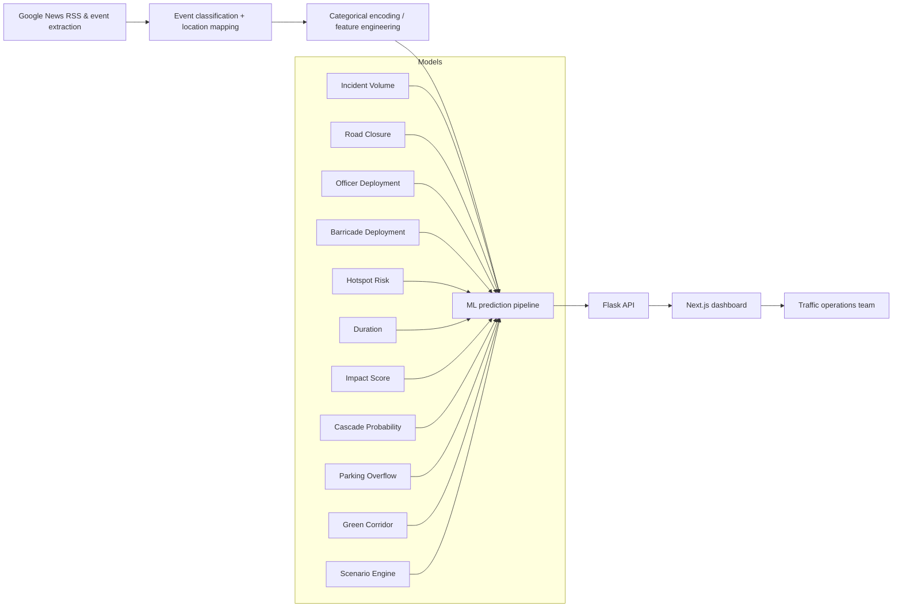

# ASTRAM CongestionIQ Hackathon Submission

## 1. Project Summary

### Title
ASTRAM CongestionIQ: Real-Time Event-Driven Traffic Intelligence for Smart City Operations

### What It Solves
City traffic teams are still operating in a reactive mode, especially during localized events such as protests, concerts, VIP movements, and construction. ASTRAM CongestionIQ transforms noisy news signals into predictive traffic operations guidance, enabling proactive deployment of officers, barricades, routing, and contingency control.

### Core Value
- Converts unstructured event news into structured event inputs and predictions
- Uses a multi-model pipeline to forecast incident volume, closure risk, hotspot load, duration, and parking overflow
- Simulates congestion cascades plus emergency green corridor routing
- Surfaces recommendations in an interactive operations dashboard
- Combines both AI prediction and operational decision support

---

## 2. System Architecture

### Overview
ASTRAM is built as a two-tier product:
- **Backend:** Flask API + model loader + prediction services
- **Frontend:** Next.js dashboard + event analysis + routing UI

### Data Flow
1. News ingestion / event extraction
2. Categorical encoding and feature assembly
3. Model prediction pipeline
4. Operational recommendation generation
5. Dashboard + scenario simulator + routing UI

### Architecture Diagram

---

## 3. Detailed Model Inventory

### 3.1 Incident Volume Forecaster
- **Name:** `incident_volume_forecaster`
- **Type:** LightGBM
- **Inputs:**
  - `zone_enc`
  - `corridor_enc`
  - `etype_enc` (event type)
  - `hour`
  - `weekday`
  - `month`
- **Output:** `prediction` (rounded incident count)
- **Used in:** baseline and event analysis volume forecast

### 3.2 Road Closure Predictor
- **Name:** `road_closure_predictor`
- **Type:** Random Forest
- **Inputs:**
  - `event_type_enc`
  - `zone_enc`
  - `corridor_enc`
  - `priority_enc`
  - `hour`
  - `duration_min`
- **Output:** `closure_probability` (0-100 from `predict_proba`)
- **Logic:** if `predict_proba` exists, convert probability to percent and classify closure risk

### 3.3 Officer Deployment Optimizer
- **Name:** `officer_deployment_predictor`
- **Type:** Gradient Boosting
- **Inputs:**
  - `event_type_enc`
  - `priority_enc`
  - `zone_enc`
  - `corridor_enc`
  - `hour`
- **Output:** `officers_needed`
- **Fallback:** Simple heuristic based on closure probability and priority

### 3.4 Barricade Deployment Optimizer
- **Name:** `barricade_deployment_predictor`
- **Type:** Gradient Boosting
- **Inputs:** same as officer deployment
- **Output:** `barricades_needed`
- **Fallback:** Closure probability driven heuristic

### 3.5 Hotspot Risk Analyzer
- **Name:** `hotspot_risk_predictor`
- **Type:** LightGBM
- **Inputs:**
  - `junction_enc`
  - `hour`
  - `weekday`
  - `event_type_enc`
- **Output:** `risk_score` (0-100)
- **Classification:** critical/high/medium/low thresholds

### 3.6 Incident Duration Predictor
- **Name:** `duration_predictor`
- **Type:** LightGBM (notebook artifact)
- **Inputs:**
  - `event_cause_enc`
  - `veh_type_enc`
  - `corridor_enc`
  - `hour`
  - `priority_enc`
- **Output:** `estimated_duration_min`
- **Transform:** supports `log1p` inverse transform for duration regression

### 3.7 Event Impact Score Model
- **Name:** `impact_score_model`
- **Type:** LightGBM / fallback heuristic
- **Inputs:**
  - `event_cause_enc`
  - `corridor_enc`
  - `priority_enc`
  - `hour`
  - `weekday`
  - `closure` (binary)
  - `predicted_volume`
  - `corridor_criticality`
- **Output:** `impact_score` (0-100)
- **Fallback:** base score + closure factor if model unavailable

### 3.8 Congestion Cascade Risk Estimator
- **Name:** `cascade_predictor`
- **Type:** Markov adjacency model
- **Inputs:**
  - `corridor`
  - `event_cause`
  - `hour`
- **Output:**
  - `prob_30`
  - `prob_60`
  - `adjacent_corridors`
- **Fallback:** default `prob_30=35` and `prob_60=55`

### 3.9 Parking Overflow Predictor
- **Name:** `parking_overflow_predictor`
- **Type:** classifier with `predict_proba`
- **Inputs:**
  - `event_cause_enc`
  - `corridor_enc`
  - `hour`
  - `weekday`
  - `event_density`
  - `closure`
- **Output:** `parking_overflow_probability` (0-100)

### 3.10 Emergency Green Corridor Pathfinder
- **Name:** `green_corridor_pathfinder`
- **Type:** Graph search data artifact
- **Inputs:**
  - `origin_corridor`
  - `destination_corridor`
- **Output:**
  - `path`
  - `total_weight`
  - `signal_override_sequence`
- **Algorithm:** Dijkstra's shortest-path search on corridor graph

### 3.11 Scenario Perturbation Engine
- **Name:** `scenario_engine`
- **Type:** JSON / heuristic engine
- **Inputs:**
  - `base_scenario`
  - `perturbation`
- **Output:** adjusted prediction multipliers for duration, incident volume, closure probability

---

## 4. Backend Prediction and API Flow

### Model Loader
- `backend/models/model_loader.py` loads:
  - joblib models from `trained_models/`
  - `advanced_label_encoders.pkl`
  - JSON scenario engine
- It exposes `model_loader.get_model(name)` and `encoder_manager.encode_value(value, feature)`
- If a model fails to load, fallback heuristics are installed for impact, cascade, and parking overflow

### Prediction Services
- `backend/models/predictors.py` defines service classes:
  - `IncidentVolumePredictor`
  - `ClosurePredictor`
  - `ResourceDeploymentPredictor`
  - `HotspotRiskPredictor`
  - `ScenarioEnginePredictor`
  - `DurationPredictor`
  - `ImpactScorePredictor`
  - `CascadePredictor`
  - `ParkingOverflowPredictor`
  - `GreenCorridorPredictor`

### API Endpoints
- `/api/v1/predictions/incident-volume`
- `/api/v1/predictions/closure-probability`
- `/api/v1/predictions/resources`
- `/api/v1/predictions/hotspot-risk`
- `/api/v1/predictions/scenario`
- `/api/v1/predictions/duration`
- `/api/v1/predictions/impact-score`
- `/api/v1/predictions/cascade`
- `/api/v1/predictions/parking-overflow`
- `/api/v1/predictions/green-corridor`

These endpoints each accept JSON payloads, call the corresponding predictor, and return structured JSON results.

### Event Analysis Pipeline
- `backend/routes/dashboard.py` implements `/analyze_event`
- It performs these steps:
  1. Parse event input (`eventType`, `zone`, `corridor`, `priority`, `date`, `time`)
  2. Predict duration via `DurationPredictor`
  3. Predict incident volume via `IncidentVolumePredictor`
  4. Predict closure probability via `ClosurePredictor`
  5. Predict officer/barricade needs via `ResourceDeploymentPredictor`
  6. Predict hotspot risk via `HotspotRiskPredictor`
  7. Predict composite impact score via `ImpactScorePredictor`
  8. Predict parking overflow via `ParkingOverflowPredictor`
  9. Predict congestion cascade via `CascadePredictor`
 10. Generate recommendations using `generate_recommendations`

- Response includes both summary metrics and raw model outputs.

### Scenario Simulation
- `/simulate_scenario` constructs a before/after comparison using:
  - baseline predicted values for planned events
  - perturbed predicted values for high-priority unplanned incidents
- It returns impact score, closure, officer count, incident volume, delay estimate, and parking overflow for both states.

### Emergency Routing
- `/emergency_route` maps source/destination names to corridor nodes
- Uses Dijkstra to compute primary path through the corridor graph
- Builds alternative detour by removing a central bottleneck node
- Optionally uses Google Directions API if API key is configured
- Returns route geometry, ETA, distance, signal actions, and bottlenecks

### Dashboard and Support APIs
- `/dashboard`: main operating dashboard payload
- `/news/events`: recent news-based event alerts
- `/cascade_spread`: static cascade graph frames for visualization
- `/event_replay`: example past incident timeline
- `/models`: model status panel
- `/operations_brief`: generated operations brief for readiness planning

---

## 5. UI Architecture and User Flow

### Dashboard Page
- File: `app/(app)/page.tsx`
- Loads:
  - `api.dashboard()` for KPI, map, and recommendations
  - `api.fetchNews()` for live news alerts
- Provides:
  - Dashboard KPI grid
  - Interactive map with corridors, hotspots, and event markers
  - Live news feed panel
  - Quick Event Analyzer modal
- The analyzer modal uses `<EventForm>` and renders a cards grid of predictions.

### Operations Suite Page
- File: `app/(app)/operations-suite/page.tsx`
- Tabs:
  - `Event Analysis`
  - `Event Replay`
- Supports:
  - user-driven event parameter analysis
  - result summary cards (`ResultStat`)
  - timeline-based recommendations
  - scenario simulator
  - emergency routing interface
  - operations brief generation

### Map Components
- `components/map/leaflet-map.tsx` renders corridors, hotspots, events, and routes
- It builds popups with:
  - event title
  - impact score
  - pre-measures
  - source link
- `components/map/map-panel.tsx` controls layer toggles

### Prediction Hooks
- `hooks/use-ml-predictions.ts` provides reusable hooks for React components:
  - `useIncidentVolumePrediction`
  - `useClosurePrediction`
  - `useResourcePrediction`
  - `useHotspotRiskPrediction`
  - `useScenarioPrediction`
  - `useIncidentAnalysis`
  - `useBatchPrediction`

These hooks coordinate API calls and manage loading/error state for the UI.

### API Client
- `lib/api.ts` defines frontend endpoints for dashboard, analysis, scenario, routing, and operations brief
- `lib/ml-api-client.ts` provides low-level ML prediction wrappers (used by hooks)
- Requests use a timeout and provide useful diagnostics when the backend is unavailable

---

## 6. Calculation Details and Engineering Notes

### Categorical Encoding
- All categorical features are encoded with label encoders from `advanced_label_encoders.pkl`
- Managed in `backend/models/model_loader.py`
- Unknown categories are mapped to `Unknown` or a default encoder value
- Alias mapping supports `event_type` → `event_cause` and `vehicle_type` → `veh_type`

### Predictive Logic
- Incident volume is rounded to the nearest event count
- Closure probability uses class probability from a Random Forest model
- Resource predictions are always at least 1 officer and at least 0 barricades
- Hotspot risk is clipped to 0-100 and mapped to severity tiers
- Duration predictor can invert `log1p` if the model was trained on transformed duration
- Impact score is bounded to 0-100 and includes corridor criticality and predicted volume as inputs
- Parking overflow uses a density lookup table and optional scaler before probability prediction
- Cascade risk uses a Markov-style lookup from `markov_table` plus adjacency for corridor spillover

### Green Corridor and Routing
- Primary route uses Dijkstra’s shortest path on corridor graph edges
- Alternative route is computed by dropping the central bottleneck node and re-running Dijkstra
- The result includes:
  - ordered `path`
  - route `polyline` or centroid coordinates
  - `etaMinutes`
  - `distanceKm`
  - `signalOverrideSequence`
  - `bottlenecks`
- If a Google Maps key is available, the app can optionally fetch a real driving route and compare it to the graph model.

### Scenario Perturbation
- Scenario engine applies multipliers to predictions:
  - `duration_multiplier`
  - `incident_volume_multiplier`
  - `closure_probability_multiplier`
- This enables “what-if” comparison of baseline versus disrupted conditions

### Recommendation Generation
- `backend/routes/dashboard.py` uses `generate_recommendations()` to create human-readable actions
- Recommendations are attached to summary output for UI presentation
- Examples include:
  - mobilize officials
  - activate alternate routing
  - publish travel advisories
  - monitor critical junctions

---

## 7. Submission Workflow

### Local Setup
1. `cd backend`
2. `python -m venv .venv`
3. `.venv\Scripts\Activate.ps1`
4. `pip install -r requirements.txt`
5. `python -m flask --app __init__ run --port=5000`

### Frontend Setup
1. `cd ..`
2. `npm install`
3. `npm run dev`
4. Open `http://localhost:3000`

### Recommended Demo Sequence
1. Open the dashboard and review KPI summaries
2. Show live event alerts and map layer interaction
3. Run a custom event analysis and explain each predicted metric
4. Demonstrate scenario simulation and outcome comparison
5. Compute an emergency green corridor route and explain the decisions
6. Generate an operations brief and highlight recommended actions

---

## 8. What Judges Should Look For
- End-to-end integration from event ingestion to actionable traffic operations guidance
- Mixed-model pipeline combining classification, regression, graph search, and scenario simulation
- Clear UI that turns predictions into operational recommendations
- Strong engineering focus on fallback resilience and real-time applicability

---

## 9. Additional Notes
- The platform is designed for Bangalore-style corridor networks but can be extended to any urban region
- The architecture separates event intelligence from action planning, making it suitable for rapid hackathon evaluation
- The submission includes both an operations command center and an ML-driven decision support engine
